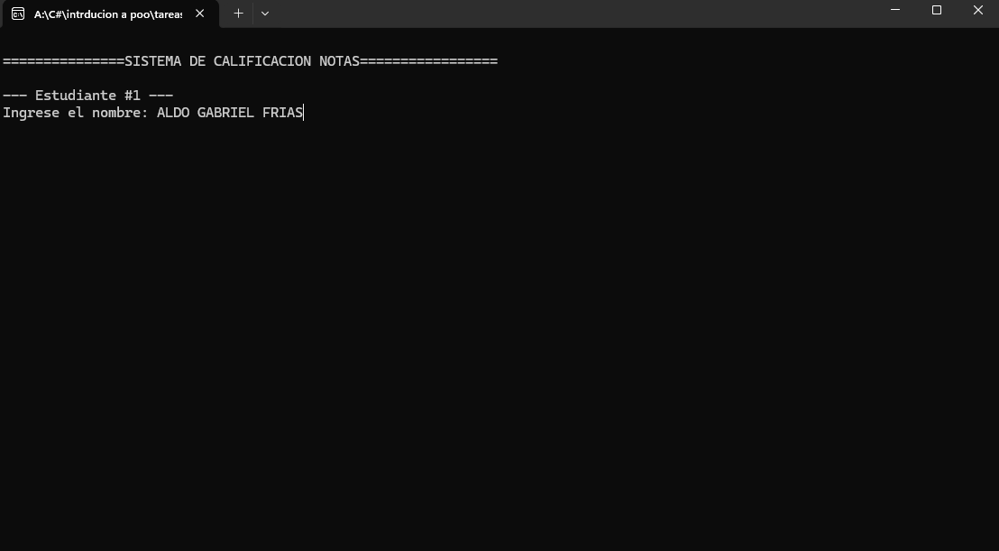
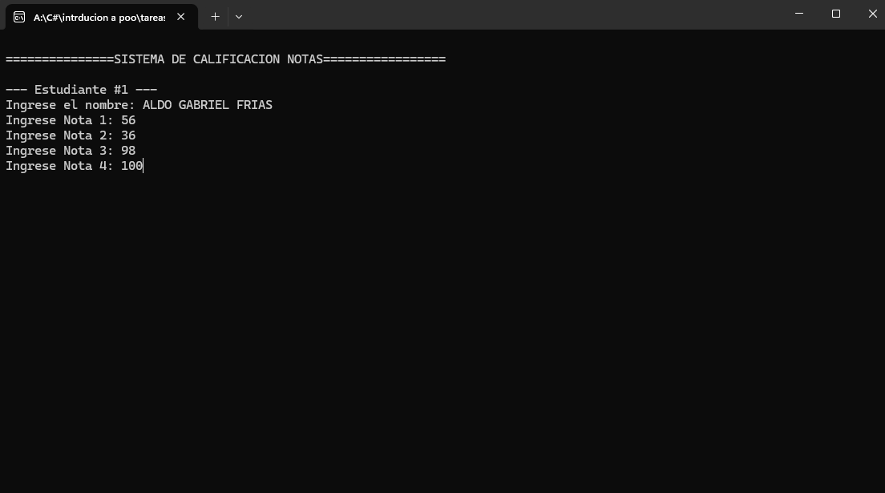
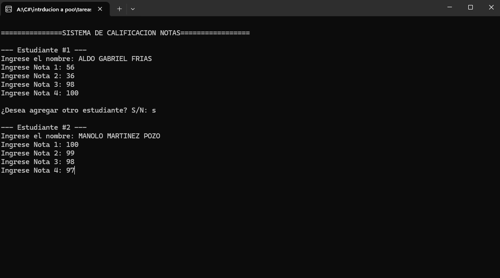
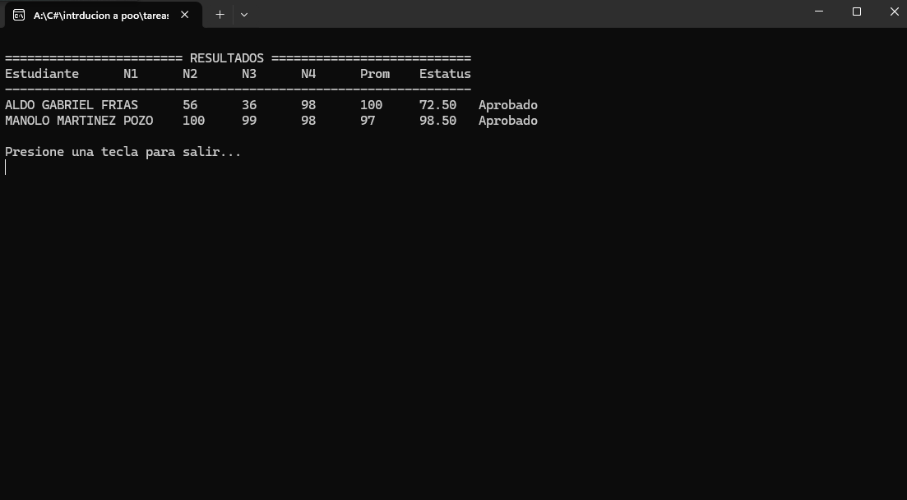

# TAREA DE FLUJO PARTE 2
"Utilizando bucles, crea un programa que permita al usuario introducir las 4 calificaciones de n cantidad de estudiantes, calcular el promedio y determinar si aprobó o reprobó, el resultado en pantalla debería ser de esta manera."

# FUNCIONAMIENTO:
Este programa gestiona un sistema de calificación académica con las siguientes funciones principales:  

- Captura de Datos: Solicita el nombre y cuatro notas de estudiantes mediante un ciclo que permite agregar múltiples registros.

- Procesamiento: Utiliza la clase Estudiante para calcular automáticamente el promedio de las notas y determinar si el alumno está "Aprobado" (promedio ≥ 70) o "Reprobado".
  
- Visualización: Muestra un reporte tabulado final con todos los datos ingresados, promedios y el estatus académico de cada estudiante.  
# EVIDENCIAS DEL FUNCIONAMIENTO:

A continuación, se presentan las capturas de pantalla que demuestran el flujo del programa:

| Etapa | Captura |
| :--- | :--- |
| **Inicio y datos** |  |
| **Ingreso de notas** |  |
| **Continuación** |  |
| **Resultados finales** |  |
